<div align="center">

#  ReviewGuard

### Intelligent AI System for Detecting Rug Pulls, Scam Tokens & Malicious Smart Contracts

[](https://www.python.org/downloads/)
[](https://flask.palletsprojects.com/)
[](LICENSE)
[]()

**ReviewGuard** is an AI-powered smart contract and crypto risk analysis platform designed to automatically detect rug pulls, scam tokens, and malicious Solidity smart contracts using Machine Learning, Deep Learning, and Behavioral Pattern Analysis.

*Helping users, researchers, and security teams assess blockchain contract trustworthiness before investment or deployment, reducing financial risk in decentralized ecosystems.*

[Features](#-key-features) • [Architecture](#️-system-architecture) • [Installation](#-installation) • [Usage](#-usage) • [Performance](#-model-performance)

---

</div>

## 🧠 Key Features

<table>
<tr>
<td width="50%">

### 🔍 **Automated Rug Pull Detection**
Identifies suspicious patterns such as:
- Liquidity removal mechanisms
- Hidden ownership controls
- Mint function abuse
- Blacklist logic vulnerabilities

</td>
<td width="50%">

### 🤖 **AI-Based Risk Scoring**
- Trained ML/DL models
- Real-time risk percentage calculation
- Multi-factor analysis engine
- Confidence score reporting

</td>
</tr>
<tr>
<td width="50%">

### 📊 **Behavioral Analysis**
Deep inspection of:
- Contract functions & modifiers
- Ownership logic patterns
- Token supply controls
- Transaction behavior

</td>
<td width="50%">

### 🌐 **Web-Based Interface**
- User-friendly upload system
- Paste smart contract code directly
- Instant analysis results
- Detailed risk breakdown

</td>
</tr>
</table>

---

## 🏗️ System Architecture

```mermaid
graph LR
    A[📝 Input Layer] --> B[🔧 Preprocessing]
    B --> C[🧠 AI Analysis Engine]
    C --> D[⚖️ Risk Assessment]
    D --> E[📊 Output Layer]
    
    style A fill:#e1f5ff
    style C fill:#fff3cd
    style E fill:#d4edda
```



| Layer | Function |
|-------|----------|
| **Input Layer** | Solidity smart contract code (manual input or file upload) |
| **Preprocessing** | Code cleaning, feature extraction (functions, permissions, patterns) |
| **AI Analysis** | Machine Learning classifiers + Deep Learning models |
| **Risk Assessment** | Weighted scoring mechanism with behavioral pattern matching |
| **Output Layer** | Risk percentage + Verdict (🟢 Safe / 🟡 Medium Risk / 🔴 High Risk) |

---

## 🧪 Methodology

```
┌─────────────────────────────────────────────────────────────┐
│  1. Feature Extraction                                      │
│     ├─ Structural features (functions, modifiers)           │
│     ├─ Semantic patterns (ownership, permissions)           │
│     └─ Behavioral signals (liquidity locks, minting)        │
├─────────────────────────────────────────────────────────────┤
│  2. Model Training                                          │
│     ├─ Known rug pull contracts                            │
│     ├─ Vulnerable but non-scam contracts                   │
│     └─ Legitimate verified contracts                       │
├─────────────────────────────────────────────────────────────┤
│  3. Hybrid Detection                                        │
│     ├─ Rule-based pattern matching                         │
│     └─ AI prediction fusion                                │
├─────────────────────────────────────────────────────────────┤
│  4. Evaluation                                              │
│     └─ Accuracy, Precision, Recall metrics                 │
└─────────────────────────────────────────────────────────────┘
```

---

## 📂 Dataset Composition

| Dataset Type | Source | Purpose |
|-------------|--------|---------|
| 🔴 **Rug Pull Contracts** | Real-world scam cases | Malicious pattern training |
| ✅ **Verified Contracts** | Ethereum blockchain explorers | Legitimate baseline |
| ⚠️ **Vulnerable Contracts** | Open research repositories | Edge case detection |
| 🏷️ **Labeled Data** | Manual annotation | Multi-class classification |

*Datasets sourced from verified blockchain explorers, security research databases, and manually curated contract repositories.*

---

## 📈 Model Performance

<div align="center">

### Accuracy Across Test Cases

| Test Case | Accuracy | Status |
|:---------:|:--------:|:------:|
| Test 1 | **100%** | ✅ |
| Test 2 | 100% | ✅ |
| Test 3 | 100% | ✅ |
| Test 4 | **100%** | ✅ |
| Test 5 | 100% | ✅ |

**Overall:** Strong detection of high-risk contracts with ongoing improvements for edge-case scenarios.

</div>

---

## 🛠️ Tech Stack

<div align="center">

| Category | Technologies |
|:--------:|:------------|
| **Backend** |   |
| **Machine Learning** |    |
| **Blockchain** |   |
| **Frontend** |    |
| **Deployment** |   |

</div>

---

## 🚀 Installation

### Prerequisites
- Python 3.8 or higher
- pip package manager
- Git

### Quick Start

```bash
# 1. Clone the repository
git clone https://github.com/your-username/ReviewGuard.git

# 2. Navigate to project directory
cd ReviewGuard

# 3. Install dependencies
pip install -r requirements.txt

# 4. Run the application
python app.py
```

### Access the Application
Open your browser and navigate to:
```
http://localhost:5000
```

---

## 💻 Usage

### Web Interface
1. **Upload Contract**: Paste Solidity code or upload `.sol` file
2. **Analyze**: Click "Analyze Contract" button
3. **Review Results**: View risk score, verdict, and detailed analysis

### Example Output
```
┌─────────────────────────────────────┐
│  Risk Score: 87%                    │
│  Verdict: 🔴 HIGH RISK              │
│                                     │
│  Detected Issues:                   │
│  • Unrestricted mint function       │
│  • Hidden ownership transfer        │
│  • No liquidity lock mechanism      │
└─────────────────────────────────────┘
```

---

## 🌍 Deployment

### Cloud Deployment Options

<table>
<tr>
<td>

**Render / Railway / Hugging Face Spaces**

✅ No local machine required  
✅ 24/7 uptime  
✅ Easy updates & redeployment  
✅ Free tier available  

</td>
<td>

```bash
# Deploy to Render
render.yaml configuration

# Deploy to Railway
railway up

# Deploy to HF Spaces
git push hf main
```

</td>
</tr>
</table>

---

## 🎯 Use Cases

| User Type | Application |
|-----------|-------------|
| 🪙 **Crypto Investors** | Pre-investment token safety verification |
| 👨‍💻 **Developers** | Smart contract auditing before deployment |
| 🔒 **Security Researchers** | Vulnerability pattern analysis |
| 🎓 **Academic Projects** | Final year / capstone demonstrations |
| 🏢 **Enterprise Teams** | Internal blockchain security audits |

---

## 🔮 Future Enhancements

```
🔄 Roadmap
├── 📡 Live blockchain monitoring
├── 💼 Wallet-based transaction analysis
├── 🌐 Multi-chain support (BSC, Polygon, Solana)
├── 📖 Explainable AI reports with visualizations
├── 🔌 RESTful API for external integrations
└── 🤝 Community-driven dataset expansion
```

---

## 🧑‍💻 Author

<div align="center">

**SASWAT KHANDAI**  
*2nd Year Student | AI & Blockchain Enthusiast*

[](mailto:saswatkhandai.com)
[](https://linkedin.com/in/saswat-khandai-417a81388)
[](https://github.com/Saswat545)

</div>

---

## 📜 License

This project is licensed under the MIT License - see the [LICENSE](LICENSE) file for details.

---

## ⭐ Support This Project

<div align="center">

If you find **ReviewGuard** helpful, please consider:

**⭐ Starring this repository**  
*Helps improve visibility and motivates further development!*

[](https://github.com/your-username/ReviewGuard)
[](https://github.com/your-username/ReviewGuard/fork)

</div>

---

## 🤝 Contributing

Contributions are welcome! Please feel free to submit a Pull Request.

1. Fork the repository
2. Create your feature branch (`git checkout -b feature/AmazingFeature`)
3. Commit your changes (`git commit -m 'Add some AmazingFeature'`)
4. Push to the branch (`git push origin feature/AmazingFeature`)
5. Open a Pull Request

---

<div align="center">

**Made with ❤️ and ☕ for a safer blockchain ecosystem**

</div>
```
